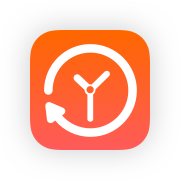

# Timely
## a free, open source Hacker News iOS client.

    

    
    
    
    

#### Easily find the most popular stories which you missed since your last visit. 
#### So what's the secret sauce? The stories you scroll through are marked as seen. The ones you open, as read. So the SmartFeed will only show you new stories, ordered by popularity. 

## Running it yourself

The app will be published once milestone v1.0 is reached. 

Until then you can clone the repo and build the project in Xcode (use the .xcworkspace file - or simply enter xed in Terminal).

## Contribution

Any help you can offer with this project is most appreciated.
**However, before you start please read the COPYRIGHT\LICENSE.md file inside this repository.** 
Although all the source code of Timely is available under the Mozilla Public License Version 2.0, the assets are not redistributable.

If you’d like to help, here are some suggestions:
- Just run the app and let me know if you hit any problems.
- If you spot redundant code, you could lend a hand in refactoring it.
- Write new tests. Tests are always a great contribution and a great place to start.
- If you find any bugs and can fix them, by all means do.
- Right now the app is available only in English. If you could help with localization, that would be a great contribution.
- I postponed any work on theming, or a dark mode - as I am expecting some official API support at this WWDC. 
- Feature ideas are great and all, problem is, I already have dozens of them queued up :)

## Credits
Timely is built using some third-party frameworks: 
- [DTCoreText](https://github.com/Cocoanetics/DTCoreText)
- [algoliasearch-client-swift](https://github.com/algolia/algoliasearch-client-swift)

Timely was designed and built by Doru Mihai Leonte. 
Timely, and the Timely logo are copyright © Doru Mihai Leonte 2019.

Swift, the Swift logo, Xcode, Instruments, Cocoa Touch, Touch ID, AirDrop, iBeacon, iPhone, iPad, Safari, App Store, watchOS, tvOS, Mac and macOS are trademarks of Apple Inc., registered in the U.S. and other countries. 

If you like Timely and want more like it, I have [a portofolio website where you can find all my projects](https://www.leonte.dev).
